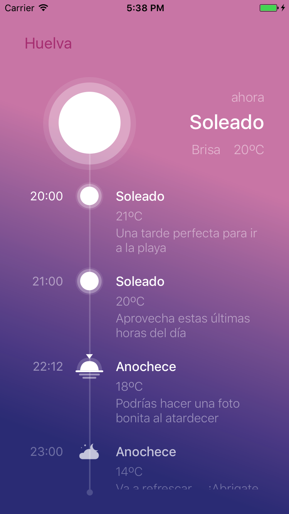

# swift-weather-controller
A swift controller to display the weather

## What you will see ...

## Requirements

iOs 13

## Installation and Usage

At first you must install the Pods (If you haven't got Pod install in your machine please follow the instructions include [here](https://cocoapods.org/))

In a console execute:
1. git clone https://github.com/daviwiki/swift-weather-controller.git
2. cd swift-weather-controller/Weather
3. pod install
4. open Weather.xcworkspace

After that execute "cmd+R" to run the project.

## Developer notes

* The datas are hardcoded into GetWeather business class. If you want to connect to real service implements the connection and parser from this layer (use of separated domain layer is recommended).

## Thanks

Special thanks to [Javi Pérez](https://dribbble.com/shots/1718042-Weather-App) for it mobile inspiration design

## Author

David Martinez
[GitHub](https://github.com/daviwiki)
[Linked-In](https://www.linkedin.com/in/david-martinez-garc%C3%ADa-b4187148/)

## License

WeatherController is available under the MIT license. See the LICENSE file for more info.
